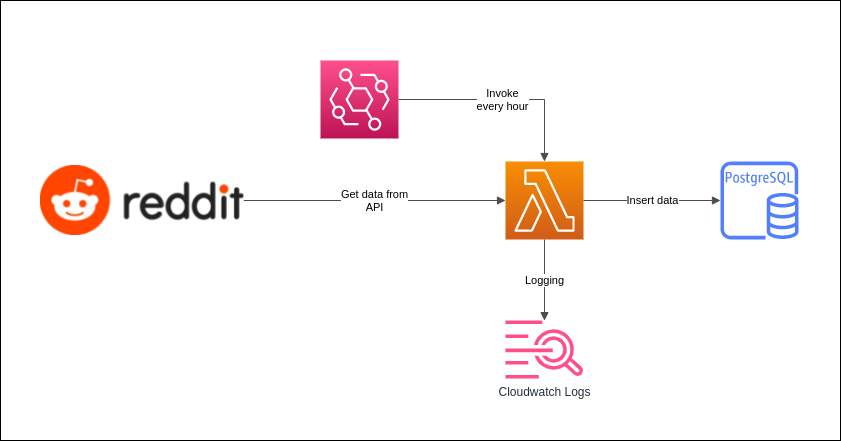

# tibrahim-pelago-reddit
Pelago - Coding Challenge - Data Engineer

## Task Detail
1. Create a data schema in any database of your choice
2. Create any AWS service of your choice to read data from the API
3. Process and clean the data as required
4. Insert top 100 HOT posts into the database table(s) on an hourly schedule from any subreddit of your choice

## Architecture


Design choices:
- I choose AWS Lambda + Serverless framework for below reasons:
    - No infrastructure/hardware to manage
    - Built-in scheduler (Eventbridge)
    - Logging provided (Cloudwatch)
    - Very low cost
    - Serverless framework to take care the deployment
- EC2 with cron option will add burden such as cost, logging and managing EC2 itself
- Workflow orchestration such as Apache Airflow will be overkill for this task

## Create AWS Lambda Security Group
- `ServerlessSG`

## Create Database
- AWS RDS Postgres `db.t3.micro`
- Allow inbound from `ServerlessSG` 

Create `hot_posts` table using SQL:
```sql
create table hot_posts (
	seqval bigserial primary key,
	id text,
	title text,
	"rank" int,
	created timestamp,
	url text,
	selftext text,
	upvote_ratio decimal(5,2),
	author text,
	author_premium boolean,
	over_18 boolean,
	treatment_tags jsonb,
	_scheduled_ts timestamp,
	_ingest_ts timestamp default now()
);
```

Most fields are mandatory from the assignment. I added:
- `seqval` as auto increment integer
- `rank` for accurate post rank and avoid additional query. Without this we will need to use SQL window function such as `ROW_NUMBER() OVER(...)` to get the rank.
- `_scheduled_ts` is the schedule timestamp
- `_ingest_ts` is the timestamp reflecting when the data is written into the database.

## Deployment
### AWS Lambda + Serverless Framework

Prerequisite:

Install serverless framework.
```bash
# install serverless framework
npm install -g serverless

# install dependencies from package.json
npm install
```

Create `env.dev.json` based on `env_example.json` and change value as required.

Create AWS Lambda IAM role called `ServerlessLambdaExecutionRole` using `AWSLambdaBasicExecutionRole`. Copy and paste the ARN into `env.json`.

```bash
# set AWS_PROFILE
export AWS_PROFILE=personal
# validate configuration
serverless print --stage dev
# get deployment info
serverless info --stage dev
# deploy
serverless deploy --stage dev
# remove
serverless remove --stage dev
```
